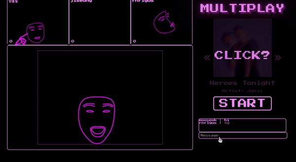
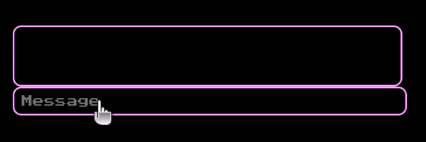
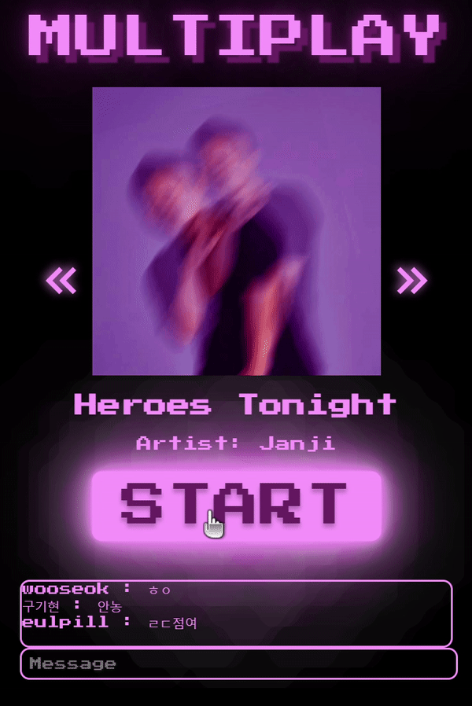
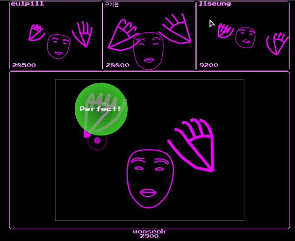

# 양구동의 에코스텝

## 프로젝트 기간
- 2023.7.3 ~ 2023.08.18

## 그랩 더 비트 서비스 화면 
- 멀티 대기방
	
	- 실시간 채팅
		
- 게임 시작
	
- 게임 플레이
	
- 게임 결과
	

## 프로젝트 소개
[시연 영상](https://youtu.be/QDowEmInfag)

**모션 인식을 이용한 멀티 플레이 리듬 게임**

주요 기능
- MediaPipe를 사용한 얼굴과 손 인식 후 Canvas처리
- OpenVidu를 사용한 화상 기능 
- Socket.io를 사용한 멀티 플레이 채팅, 곡 선택, 게임 시작, 결과 보기  
- OAuth2를 사용한 구글 로그인


## 특장점
- 노트 최적화
- 오픈비두 커스터마이징
	- 웹 캠 화면을 가공하여 서버에 가공된 이미지를 전송  
- 화상 기능
	- 내 웹 캠 화면에 추가적으로 CSS 작업을 수행
- 실시간 통신 기능
	- 모든 플레이어의 점수를 실시간으로 공유

---
## 개발환경

* Backend
- IntelliJ IDEA 2023.1.3
- opendk 11.0.20
- Gradle 7.1.1
- Spring Boot 2.7.14
- MySQL  Ver 8.0.34-0ubuntu0.20.04.1 for Linux on x86_64 ((Ubuntu))
- Node.js v16.13.0
- npm 8.1.0

* Frontend
- React.js v18.2.0
- Visual Studio Code
- redux v8.1.2

* Web RTC
- OpenVidu 2.28.0
- MediaPipe v0.10.3, hands v0.4.1675469240
- Socket.io v4.7.2

* CI/CD
- aws ec2
- nginx
- jenkins

---
## 시연 순서

0. 홈 화면에서 시작
1. `Continue to Google`을 눌러 로그인
2. `CREATE GAME` 버튼을 눌러 페이지 이동
3. `PLAY MULTI` 버튼을 눌러 페이지 이동
4. 이름 입력
5. `CLICK?`, 노래 변경 버튼 `>>`을 눌러 노래 재생
6. 플레이어들의 화면, 노래 변경 재생, 채팅 확인
7. `START`를 눌러 게임 시작
8. 게임 플레이
9. 게임이 종료되고 `RESULT` 버튼을 눌러 결과창으로 이동
10. 결과 확인
11. `QUIT` 버튼을 눌러 홈으로 이동

## 팀원 역할 
|이지승|이우석|양을필|박종민|김동준|구기현|
|:---:|:---:|:---:|:---:|:---:|:---:|
|BE/INFRA/OpenVidu|BE/WebSocket/Auth|FE/GameClient/Mediapipe/UCC|FE/OpenVidu/WebSocket|FE/UI/UX/Design|BE/WebSocket/INFRA|

---
## Frontend
```
git clone https://lab.ssafy.com/s09-webmobile2-sub2/S09P12A607.git
cd S09P12A607/fe/grab-front-app
npm install
npm start
```

## Backend

```
git clone https://lab.ssafy.com/s09-webmobile2-sub2/S09P12A607.git
cd S09P12A607/be
gradle build
java -jar build/libs/grab_the_beat-0.0.1-SNAPSHOT.jar
```

## Openvidu

```
sudo su
cd /opt
curl <https://s3-eu-west-1.amazonaws.com/aws.openvidu.io/install_openvidu_latest.sh> | bash
cd openvidu
```
- 오픈비두 설정
```
nano .env

DOMAIN_OR_PUBLIC_IP=i9a607.p.ssafy.io
OPENVIDU_SECRET=a607
CERTIFICATE_TYPE=letsencrypt
LETSENCRYPT_EMAIL=user@example.com
HTTP_PORT=8442
HTTPS_PORT=8443
```
- 오픈비두 실행, 종료
```
./openvidu start
./openvidu stop
```
## Web Socket

```
git clone https://lab.ssafy.com/s09-webmobile2-sub2/S09P12A607.git
cd S09P12A607/test/websocketserver-test
npm install
node index.js
```

## 설정 파일
- S09P12A607/be/src/main/resources/application.yml
```
spring:
  jpa:
    show-sql: true
    hibernate:
      # db 초기화 전략. 기존 테이블 삭제 후 생성.
      ddl-auto: create
    properties:
      hibernate:
        # 만들어진 sql 보여줌.
        show_sql: true
        # sql 가독성 좋게 보여줌.
        format_sql: true
    defer-datasource-initialization: true
  datasource:
    driver-class-name: com.mysql.cj.jdbc.Driver
    url: jdbc:mysql://localhost:3306/grabthebeat?serverTimezone=Asia/Seoul
    username: root
    password: ssafy
  h2:
    console:
      enabled: true
  security:
    oauth2:
      client:
        registration:
          google:
            client-id: 525828643148-v0tejekvh7e7f047qde9rt1kg4nae1qp.apps.googleusercontent.com
            client-secret: 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
            redirect-uri: https://i9a607.p.ssafy.io/login/oauth2/code/google
            scope:
              - email
              - profile

jwt:
  issuer: dldntjr0516@gmail.com
  secret_key: ygd-grabthebeat

server:
  ssl:
    enabled: false
  port: 5000

OPENVIDU_URL: http://localhost:4443
OPENVIDU_SECRET: MY_SECRET

CALL_OPENVIDU_CERTTYPE: selfsigned
```

- S09P12A607/fe/grab-front-app/.env
```
REACT_APP_SPRING_URL="https://i9a607.p.ssafy.io"
REACT_APP_SOCKET_URL='https://i9a607.p.ssafy.io'
REACT_APP_OPENVIDU_URL='https://i9a607.p.ssafy.io'
REACT_APP_WS_URL='https://i9a607.p.ssafy.io'
```

- S09P12A607/test/websocketserver-test/.env
```
REACT_APP_URL="https://i9a607.p.ssafy.io"
```

- /etc/nginx/nginx.conf
```
events {
    worker_connections 512;
}
http {
    upstream openvidu-deployment {
        server i9a607.p.ssafy.io:8443;
    }
    upstream server-application {
        server i9a607.p.ssafy.io:5000;
    }
    upstream client-application {
        server i9a607.p.ssafy.io:3000;
    }
    upstream socket-application {
        server i9a607.p.ssafy.io:8000;
    }
    server {
        listen                  443 ssl;
        ssl_certificate         /etc/letsencrypt/live/i9a607.p.ssafy.io/cert.pem;
        ssl_certificate_key     /etc/letsencrypt/live/i9a607.p.ssafy.io/privkey.pem;

        proxy_set_header Host $host;
        proxy_set_header X-Real-IP $remote_addr;
        proxy_set_header X-Forwarded-For $proxy_add_x_forwarded_for;
        proxy_set_header X-Forwarded-Proto $scheme;
        proxy_set_header X-Forwarded-Proto https;
        proxy_headers_hash_bucket_size 512;
        proxy_redirect off;

        # Websockets
        proxy_http_version 1.1;
        proxy_set_header Upgrade $http_upgrade;
        proxy_set_header Connection "upgrade";

        # OpenVidu deployment API
        location /openvidu/api {
            proxy_pass http://openvidu-deployment;
        }

        # OpenVidu WebSocket
        location ~ /openvidu$ {
            proxy_pass http://openvidu-deployment;
        }

        # Server application requests
        location /api/ {
            proxy_pass http://server-application;
        }
        location /oauth2/ {
            proxy_pass http://server-application;
        }
        location /login/ {
            proxy_pass http://server-application;
        }

        # Client application requests
        location / {
            proxy_pass http://client-application;
        }

        location /socket.io {
            proxy_pass http://socket-application;
        }
    }
}
```

## 포트
```
22 TCP
80 TCP
443 TCP
3000
3306
3478 TCP+UDP
5000
8000 
8442
8443
8800
40000 - 57000 TCP+UDP
57001 - 65535 TCP+UDP
```

